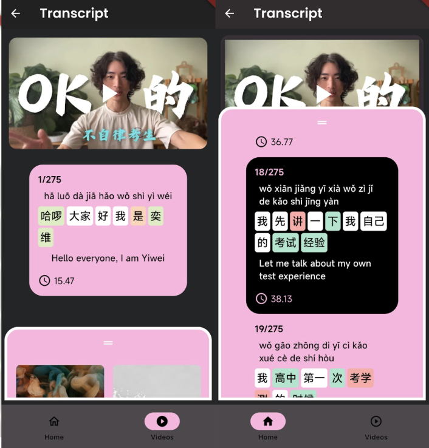

# About 

### Home Page

A language app for intermediate chinese learners, utilising spaced repetition, microlearning, gamification and context-based learning techniques. 

### Watch YouTube videos

Users can download a YouTube video with chinese captions. These captions are then segmented into chinese words based on NLP libraries in the Flask backend. The transcript follows the video in real-time so users can practice "shadowing", a technique where students mimic the speaker in the video.

### Create Flashcards

When students encounter an unfamiliar word in the transcript, they can click on the word they want to learn. This brings them into the review page where they can see stroke order animations and follow a user flow of listening to the word, reading its translation, selecting an image and adding their own personal note to that flashcard. The images provided are the top 3 images from Google Images.

### Play Short Games

Based on a spaced-repetition algorithm (words are resurfaced to the user at optimal times before they forget the word), users play short games to learn new vocabulary. Fill in the blank exercises, writing exercises (testing stroke order), matching images to words, translation exercises and speech exercises are available.

# Running the app

The app currently runs on a private network (it is not publicly available). Furthermore, the API keys are not supplied in this repository, for safety reasons. If you are interested in using the app, please contact me via email.